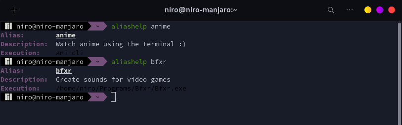
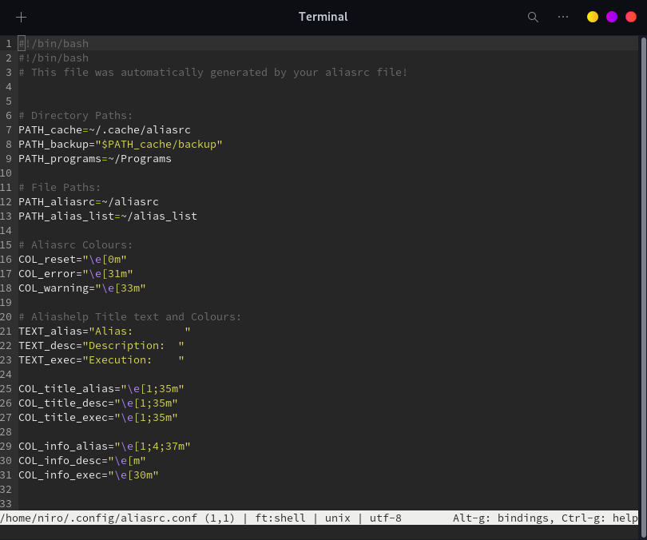
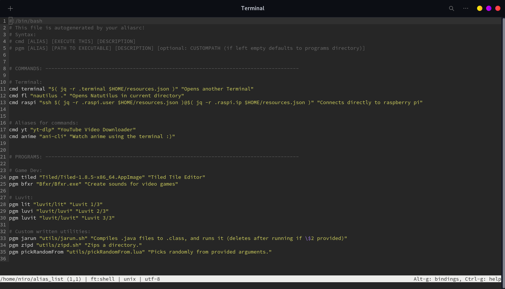

# aliasrc

This is the repository for my personal alias "manager". Feel free to use it and
modify to your hearts content!

# Installation

## Manual Installation

You can manually download the aliasrc file and add "source PATH_TO_ALIASRC"
(default: `source ~/aliasrc`) at the bottom of your shell rc file.

Most common shells you may have:

- bash (~/.bashrc)
- zsh (~/.zshrc)

Most Shells follow this style. (if you don't know which shell you are using, 
execute `echo $SHELL` in your terminal)

## Automatic installation

Coming Soon!

# Features

## Command `aliashelp`

Easily manage your custom aliases in one file. Add comments to your aliases and
use `aliashelp ALIAS_HERE` to display information about the alias (description
and what it actually executes).

Type `aliashelp` to list all custom aliases you set using aliasrc

## Command `aliasrc_update`

Fetch the newest version of aliasrc from this repository. 

## "cmd" and "pgm"

Your aliasrc file should not contain your actual aliases, for that an extra
file is created, called "alias_list" by default. You can specify your aliases
in there without seeing any of the scary and bad code of the actual aliasrc
file.

Syntax:

```bash
# Three inputs for command aliases:
# 1. alias (the command you will type in your terminal)
# 2. command (this will be executed when you type in the alias)
# 3. Comment/Description what the command does (optional, but recommended of course)
cmd "update_system" "sudo apt update && sudo apt upgrade -y" "Updates entire systems packages"


# !! Two different options for program aliases:

# Three inputs for program aliases:
# 1. same as in command alias
# 2. name of the binary/executable (in your Programs directory! For example ~/Programs/ or similar (can be changed in the config) )
# 3. same as in command alias
pgm "startEpicProgram" "EpicProgram.AppImage" "Starts an epic program from the terminal"

# Four inputs for programs outside your defined Programs directory:
# 4. Path to binary file (excluding the binary itself)
pgm "startAnotherProgram" "anotherEpicProgram" "Starts another epic program" ~/AnotherDirectory/Programs/
```

Additionally "pgm" checks if the executable is in the specified location, and
tells you if no valid file was found.

## Configuration

On first startup aliasrc creates a config file (default:
`~/.config/aliasrc.conf`), where you can change several variables.

Relaunch your session or re-source aliasrc for changes to apply.

Config options include:

- path to cache directory, backup directory (aliasrc will be backed up when
updating)
- path to alias_list file
- colours of aliashelp output, colours of warning and error messages
- static text output for aliashelp command

## Screenshots





